# PandaDaw - Documentación Técnica Completa

**Versión:** 1.0  
**Fecha:** Febrero 2026  
**Equipo de Desarrollo:** 3 Desarrolladores  
**Tarifa:** 25€/hora/desarrollador

---

## 1. Resumen Ejecutivo

**PandaDaw** es una plataforma de comercio electrónico desarrollada con tecnología **.NET 10** que permite la venta de productos de electrónica de consumo. El proyecto está formado por una solución con 4 proyectos:

### 1.1 Proyectos en la Solución

| Proyecto | Tipo | Descripción |
|----------|------|-------------|
| **PandaDawRazor** | Web Application | Interfaz de usuario con Razor Pages y Blazor Server |
| **PandaBack** | Class Library | API REST, servicios, repositorios y modelos |
| **Tests** | Unit Tests | Pruebas unitarias con xUnit |
| **PandaDaw-Playwright** | E2E Tests | Pruebas end-to-end con Playwright |

### 1.2 Características Implementadas

- 🛒 Carrito de compras persistente
- ❤️ Sistema de favoritos por usuario
- ⭐ Sistema de valoraciones y reseñas en tiempo real
- 👤 Autenticación con ASP.NET Identity
- 🔐 Autorización basada en roles (User/Admin)
- 📦 Gestión completa de productos (CRUD)
- 💳 Sistema de pagos con Stripe
- 📄 Generación de facturas con QuestPDF
- 📧 Envío de emails con MailKit
- 🔔 Notificaciones en tiempo real (Blazor/SignalR)
- 📱 Diseño responsivo con Tailwind CSS + DaisyUI
- 🗄️ Base de datos PostgreSQL con Entity Framework Core

---

## 2. Arquitectura del Sistema

### 2.1 Diagrama de Arquitectura General

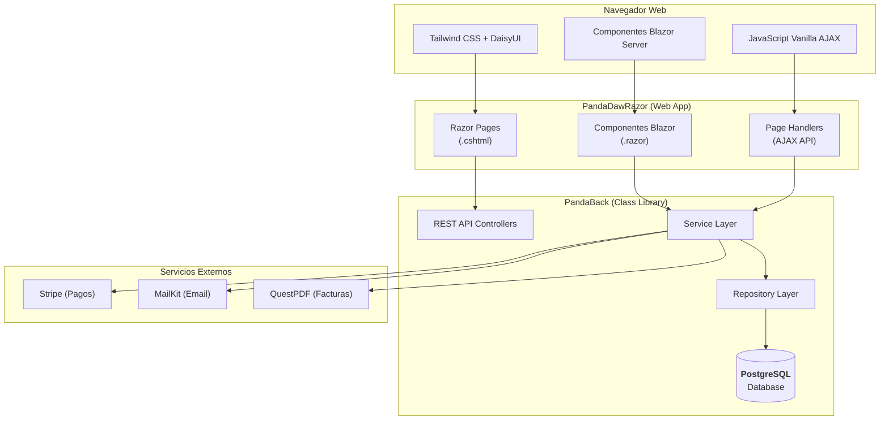
```mermaid
flowchart TB
    subgraph Client["Navegador Web"]
        UI[Tailwind CSS + DaisyUI]
        Blazor[Componentes Blazor Server]
        JS[JavaScript Vanilla AJAX]
    end

    subgraph Frontend["PandaDawRazor (Web App)"]
        Pages["Razor Pages<br/>(.cshtml)"]
        Components["Componentes Blazor<br/>(.razor)"]
        Handlers["Page Handlers<br/>(AJAX API)"]
    end

    subgraph Backend["PandaBack (Class Library)"]
        API["REST API Controllers"]
        Services["Service Layer"]
        Repositories["Repository Layer"]
        DB[("<b>PostgreSQL</b><br/>Database")]
    end

    subgraph External["Servicios Externos"]
        Stripe["Stripe (Pagos)"]
        Email["MailKit (Email)"]
        PDF["QuestPDF (Facturas)"]
    end

    UI --> Pages
    Blazor --> Components
    JS --> Handlers
    
    Pages --> API
    Components --> Services
    Handlers --> Services
    Services --> Repositories
    Repositories --> DB
    
    Services --> Stripe
    Services --> Email
    Services --> PDF
```

### 2.2 Patrón de Arquitectura (Clean Architecture)


```mermaid
flowchart LR
    subgraph Presentation["Capa de Presentación"]
        direction TB
        P1["Razor Pages"]
        P2["Blazor Components"]
        P3["REST Controllers"]
    end

    subgraph Application["Capa de Aplicación"]
        direction TB
        S1["Servicios<br/>(Business Logic)"]
        S2["Validadores<br/>(FluentValidation)"]
        S3["Mappers<br/>(DTO ↔ Model)"]
    end

    subgraph Domain["Capa de Dominio"]
        direction TB
        D1["Modelos<br/>(Entities)"]
        D2["DTOs<br/>(Data Transfer)"]
        D3["Enums"]
    end

    subgraph Infrastructure["Capa de Infraestructura"]
        direction TB
        I1["Repositories"]
        I2["DbContext<br/>(EF Core)"]
        I3["Identity"]
    end

    Presentation --> Application
    Application --> Domain
    Domain --> Infrastructure
```

---

## 3. Estructura del Proyecto

### 3.1 Proyectos y Dependencias

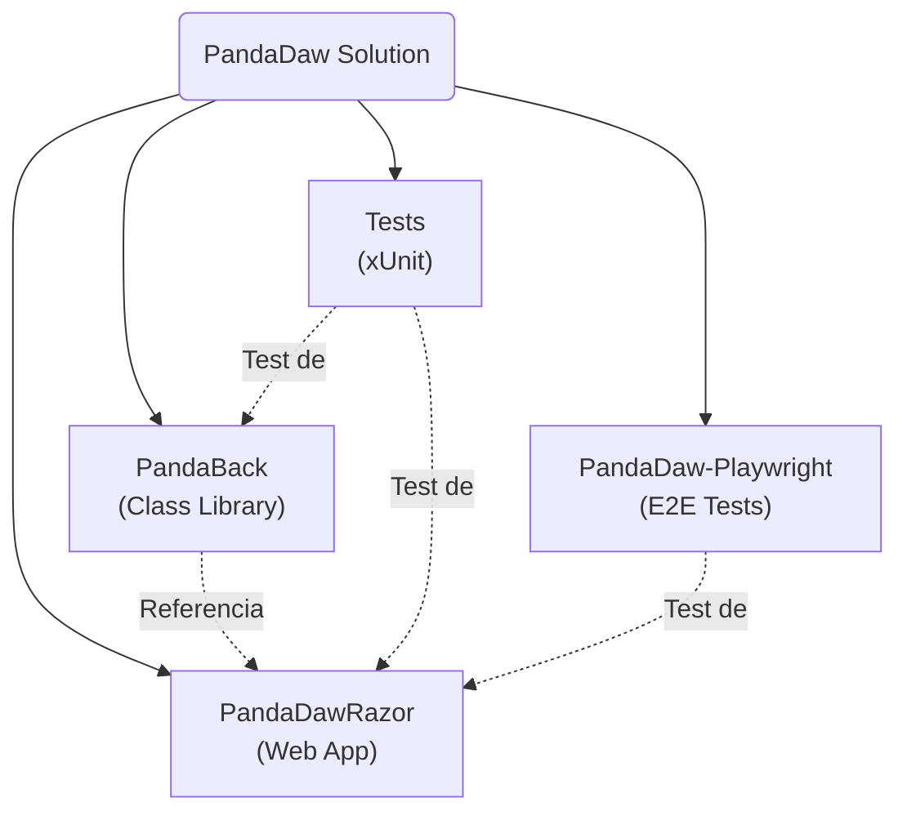
```mermaid
graph TD
    Solution("PandaDaw Solution")
    
    PandaDawRazor["PandaDawRazor<br/>(Web App)"]
    PandaBack["PandaBack<br/>(Class Library)"]
    Tests["Tests<br/>(xUnit)"]
    Playwright["PandaDaw-Playwright<br/>(E2E Tests)"]
    
    Solution --> PandaBack
    Solution --> PandaDawRazor
    Solution --> Tests
    Solution --> Playwright
    
    PandaBack -.->|Referencia| PandaDawRazor
    Tests -.->|Test de| PandaBack
    Tests -.->|Test de| PandaDawRazor
    Playwright -.->|Test de| PandaDawRazor
```

### 3.2 Estructura de Carpetas - PandaBack

```
PandaBack/
├── config/                      # Configuraciones
│   ├── CacheConfig.cs          # Configuración de caché
│   └── DotEnvLoader.cs         # Carga de variables de entorno
├── Data/                       # Capa de datos
│   ├── PandaDbContext.cs       # Contexto EF Core
│   └── DataSeeder.cs           # Datos iniciales
├── Dtos/                       # Objetos de Transferencia
│   ├── Auth/                   # DTOs de autenticación
│   ├── Carrito/               # DTOs del carrito
│   ├── Favoritos/              # DTOs de favoritos
│   ├── Productos/              # DTOs de productos
│   ├── Valoraciones/           # DTOs de valoraciones
│   └── Ventas/                 # DTOs de ventas
├── Errors/                     # Manejo de errores
│   └── PandaError.cs          # Errores tipados
├── Mappers/                    # Mapeo DTO ↔ Modelo
├── Middleware/                 # Middleware personalizado
│   └── GlobalExceptionHandler.cs
├── Models/                     # Entidades del dominio
│   ├── Carrito.cs
│   ├── Categoria.cs
│   ├── Favorito.cs
│   ├── LineaCarrito.cs
│   ├── LineaVenta.cs
│   ├── Producto.cs
│   ├── User.cs
│   ├── Valoracion.cs
│   ├── Venta.cs
│   ├── Role.cs
│   └── EstadoPedido.cs
├── Repositories/               # Repositorios (datos)
├── RestController/             # Controladores API REST
├── Services/                   # Servicios (lógica)
│   ├── Auth/
│   ├── Carrito/
│   ├── Email/
│   ├── Factura/
│   ├── Favoritos/
│   ├── Productos/
│   ├── Stripe/
│   ├── Valoraciones/
│   └── Ventas/
├── Validators/                 # Validadores FluentValidation
└── Program.cs
```

### 3.3 Estructura de Carpetas - PandaDawRazor

```
PandaDawRazor/
├── Components/                  # Componentes Blazor
│   ├── ContadorCarrito.razor   # Badge contador carrito
│   ├── NotificacionesToast.razor # Notificaciones toast
│   └── ValoracionesRealtime.razor # Valoraciones en tiempo real
├── Filters/                    # Filtros de páginas
│   └── NavBadgePageFilter.cs
├── Pages/                      # Páginas Razor
│   ├── AdminPanel.cshtml       # Panel de administración
│   ├── Api.cshtml             # Endpoint AJAX
│   ├── Carrito.cshtml         # Carrito de compras
│   ├── Detalle.cshtml         # Detalle de producto
│   ├── Favoritos.cshtml        # Lista de favoritos
│   ├── Index.cshtml           # Página principal
│   ├── Login.cshtml           # Inicio de sesión
│   ├── Pago.cshtml            # Página de pago
│   ├── PagoExitoso.cshtml     # Confirmación de pago
│   ├── Pedidos.cshtml         # Historial de pedidos
│   ├── Register.cshtml        # Registro de usuario
│   ├── Logout.cshtml          # Cerrar sesión
│   ├── Error.cshtml           # Página de error
│   └── Shared/
│       └── _Layout.cshtml     # Layout principal
├── Services/                   # Servicios cliente
│   └── NotificacionService.cs # Servicio de notificaciones
├── wwwroot/                   # Archivos estáticos
│   ├── css/
│   ├── js/
│   └── lib/
├── Program.cs
└── PandaDawRazor.csproj
```

---

## 4. Modelo de Datos

### 4.1 Entidades y Relaciones

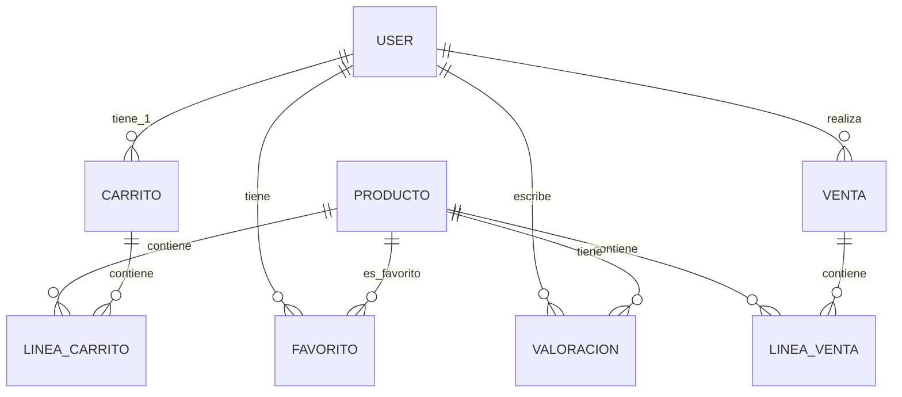
```mermaid
erDiagram
    USER ||--o{ CARRITO : tiene_1
    USER ||--o{ FAVORITO : tiene
    USER ||--o{ VALORACION : escribe
    USER ||--o{ VENTA : realiza
    
    PRODUCTO ||--o{ LINEA_CARRITO : contiene
    PRODUCTO ||--o{ LINEA_VENTA : contiene
    PRODUCTO ||--o{ FAVORITO : es_favorito
    PRODUCTO ||--o{ VALORACION : tiene
    
    CARRITO ||--o{ LINEA_CARRITO : contiene
    VENTA ||--o{ LINEA_VENTA : contiene
```

### 4.2 Detalle de Entidades

#### Usuario (User)
- **Herencia:** IdentityUser (ASP.NET Identity)
- **Campos propios:** Nombre, Apellidos, Avatar, Role, FechaAlta, IsDeleted
- **Relaciones:** Carrito (1:1), Ventas (1:N), Valoraciones (1:N), Favoritos (1:N)

#### Producto
- **Campos:** Id, Nombre, Descripcion, Precio, Stock, Imagen, Category, FechaAlta, IsDeleted
- **Índices:** Category, IsDeleted
- **Relaciones:** LineaCarrito (1:N), LineaVenta (1:N), Favoritos (1:N), Valoraciones (1:N)

#### Carrito
- **Campos:** Id, UserId, FechaActualizacion
- **Relaciones:** Usuario (N:1), LineaCarrito (1:N)

#### Venta
- **Campos:** Id, UserId, Total, Estado, FechaVenta
- **Relaciones:** Usuario (N:1), LineaVenta (1:N)

### 4.3 Enumeraciones

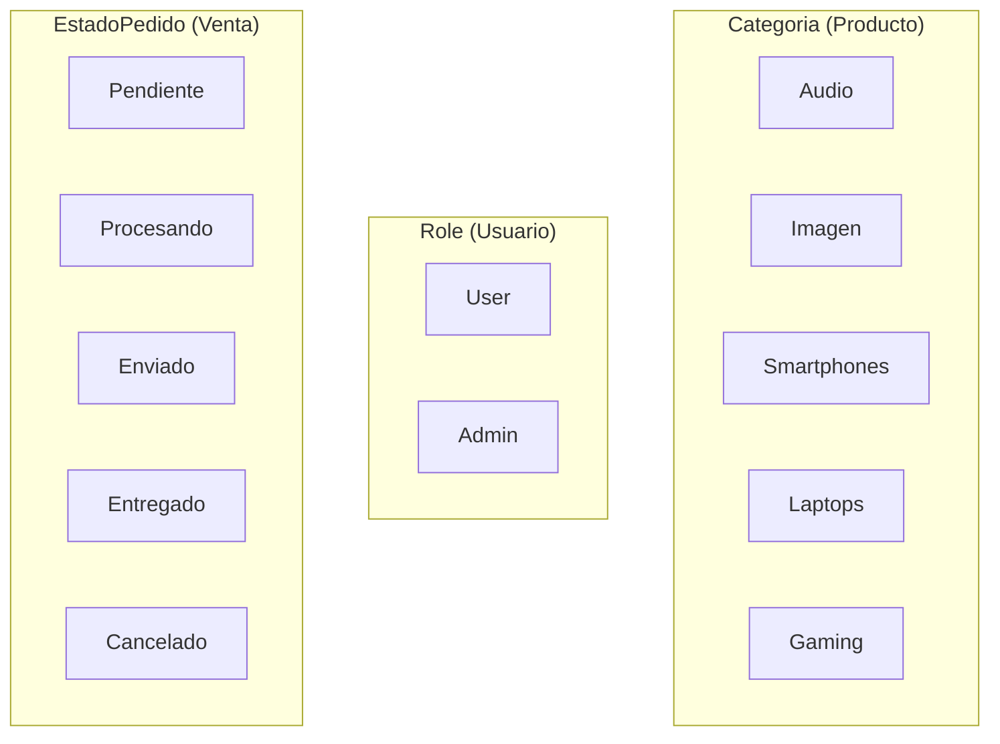
```mermaid
graph TB
    subgraph Categoria["Categoria (Producto)"]
        C1[Audio]
        C2[Imagen]
        C3[Smartphones]
        C4[Laptops]
        C5[Gaming]
    end

    subgraph Role["Role (Usuario)"]
        R1[User]
        R2[Admin]
    end

    subgraph Estado["EstadoPedido (Venta)"]
        E1[Pendiente]
        E2[Procesando]
        E3[Enviado]
        E4[Entregado]
        E5[Cancelado]
    end
```

---

## 5. Catálogo de Productos (DataSeeder)

El sistema incluye **20 productos** precargados en las siguientes categorías:

| Categoría | Productos |
|-----------|-----------|
| **Smartphones** | iPhone 15 Pro Max, Samsung Galaxy S24 Ultra, Google Pixel 8 Pro, Xiaomi 14 Pro |
| **Audio** | AirPods Pro 2ª gen, Sony WH-1000XM5, Bose QuietComfort Ultra, JBL Flip 6 |
| **Laptops** | MacBook Pro 16" M3 Max, ASUS ROG Zephyrus G14, Dell XPS 15, MacBook Air 15" M3 |
| **Gaming** | PS5 Slim, Nintendo Switch OLED, Xbox Series X, Valve Steam Deck OLED |
| **Imagen** | Sony Alpha 7 IV, LG OLED 65" C3, DJI Mini 4 Pro, GoPro HERO12 Black |

### 5.1 Usuarios de Prueba

| Email | Contraseña | Rol |
|-------|------------|-----|
| admin@pandadaw.com | Admin123! | Admin |
| usuario1@pandadaw.com | Usuario123! | User |
| usuario2@pandadaw.com | Usuario123! | User |

---

## 6. API REST Endpoints

### 6.1 Controladores Disponibles

| Controlador | Prefijo | Métodos | Autenticación |
|------------|---------|---------|---------------|
| AuthController | /api/auth | POST register, POST login | Pública |
| ProductosController | /api/productos | GET, GET {id}, GET categoria, POST, PUT, DELETE | Admin para write |
| CarritoController | /api/carrito | GET, POST lineas, PUT lineas/{id}, DELETE lineas/{id}, DELETE | Requiere Auth |
| FavoritosController | /api/favoritos | GET {userId}, POST, DELETE {id} | Requiere Auth |
| ValoracionesController | /api/valoraciones | GET producto, POST, PUT {id}, DELETE {id} | Auth para write |
| VentasController | /api/ventas | GET, GET mis-pedidos, GET {id}, GET {id}/factura, POST, PATCH {id}/estado | Mixto |

### 6.2 Diagrama de Endpoints - Auth

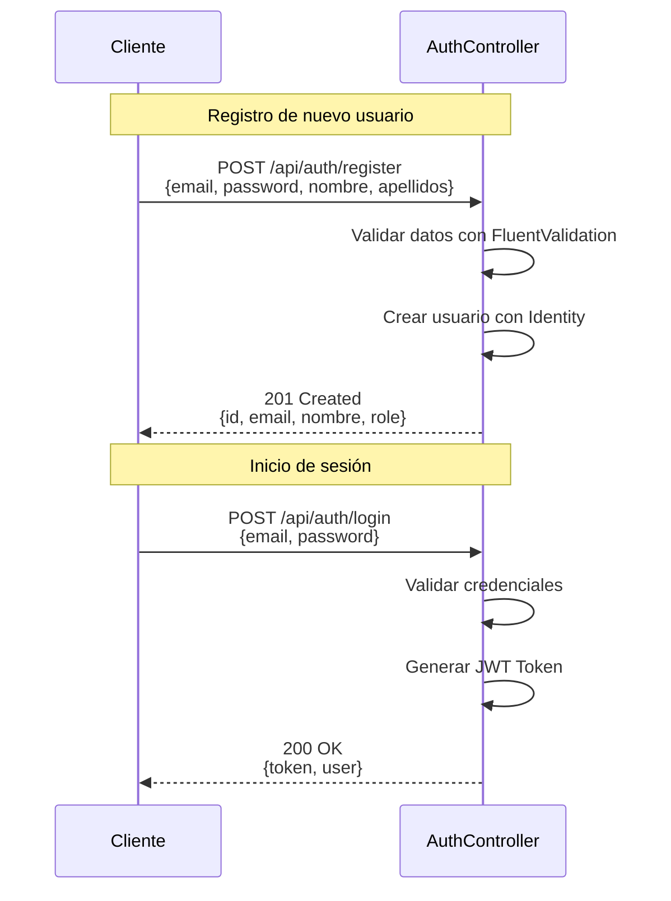
```mermaid
sequenceDiagram
    participant Client as Cliente
    participant API as AuthController
    
    Note over Client,API: Registro de nuevo usuario
    Client->>API: POST /api/auth/register<br/>{email, password, nombre, apellidos}
    API->>API: Validar datos con FluentValidation
    API->>API: Crear usuario con Identity
    API-->>Client: 201 Created<br/>{id, email, nombre, role}
    
    Note over Client,API: Inicio de sesión
    Client->>API: POST /api/auth/login<br/>{email, password}
    API->>API: Validar credenciales
    API->>API: Generar JWT Token
    API-->>Client: 200 OK<br/>{token, user}
```

### 6.3 Diagrama de Endpoints - Carrito

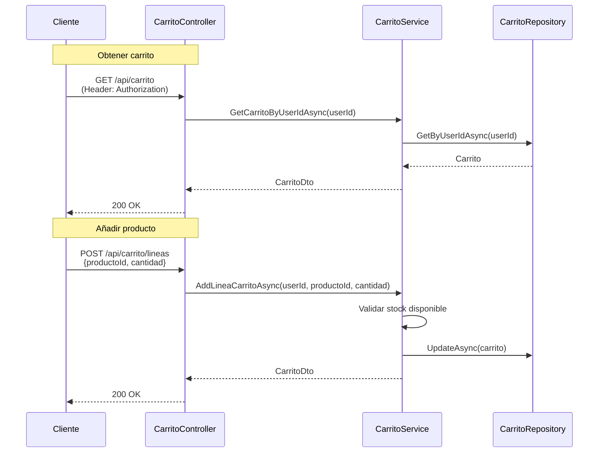
```mermaid
sequenceDiagram
    participant Client as Cliente
    participant API as CarritoController
    participant Service as CarritoService
    participant Repo as CarritoRepository
    
    Note over Client,API: Obtener carrito
    Client->>API: GET /api/carrito<br/>(Header: Authorization)
    API->>Service: GetCarritoByUserIdAsync(userId)
    Service->>Repo: GetByUserIdAsync(userId)
    Repo-->>Service: Carrito
    Service-->>API: CarritoDto
    API-->>Client: 200 OK
    
    Note over Client,API: Añadir producto
    Client->>API: POST /api/carrito/lineas<br/>{productoId, cantidad}
    API->>Service: AddLineaCarritoAsync(userId, productoId, cantidad)
    Service->>Service: Validar stock disponible
    Service->>Repo: UpdateAsync(carrito)
    Service-->>API: CarritoDto
    API-->>Client: 200 OK
```

### 6.4 Diagrama de Endpoints - Ventas

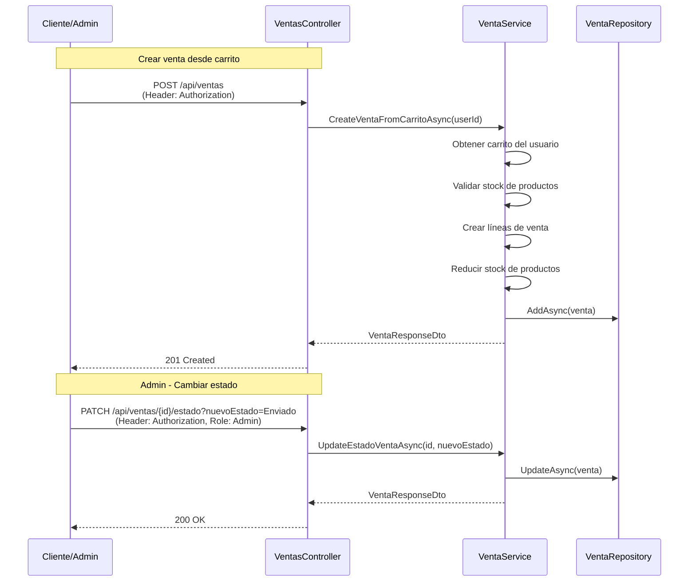
```mermaid
sequenceDiagram
    participant Client as Cliente/Admin
    participant API as VentasController
    participant Service as VentaService
    participant Repo as VentaRepository
    
    Note over Client,API: Crear venta desde carrito
    Client->>API: POST /api/ventas<br/>(Header: Authorization)
    API->>Service: CreateVentaFromCarritoAsync(userId)
    Service->>Service: Obtener carrito del usuario
    Service->>Service: Validar stock de productos
    Service->>Service: Crear líneas de venta
    Service->>Service: Reducir stock de productos
    Service->>Repo: AddAsync(venta)
    Service-->>API: VentaResponseDto
    API-->>Client: 201 Created
    
    Note over Client,API: Admin - Cambiar estado
    Client->>API: PATCH /api/ventas/{id}/estado?nuevoEstado=Enviado<br/>(Header: Authorization, Role: Admin)
    API->>Service: UpdateEstadoVentaAsync(id, nuevoEstado)
    Service->>Repo: UpdateAsync(venta)
    Service-->>API: VentaResponseDto
    API-->>Client: 200 OK
```

### 6.5 Tabla de Códigos de Respuesta

| Código | Significado |
|--------|------------|
| 200 | OK - Operación exitosa |
| 201 | Created - Recurso creado |
| 204 | No Content - Operación exitosa sin contenido |
| 400 | Bad Request - Datos inválidos |
| 401 | Unauthorized - No autenticado |
| 403 | Forbidden - Sin permisos |
| 404 | Not Found - Recurso no encontrado |
| 500 | Internal Server Error - Error del servidor |

---

## 7. Servicios Backend (Interfaces)

### 7.1 Servicios Implementados - Código Real


```mermaid
classDiagram
    class IProductoService {
        <<interface>>
        +GetAllProductosAsync() Result~IEnumerable~Producto~~, PandaError~~
        +GetProductoByIdAsync(id) Result~Producto, PandaError~~
        +GetProductosByCategoryAsync(cat) Result~IEnumerable~Producto~~, PandaError~~
        +CreateProductoAsync(producto) Result~Producto, PandaError~~
        +UpdateProductoAsync(id, producto) Result~Producto, PandaError~~
        +DeleteProductoAsync(id) Result~Unit, PandaError~~
    }

    class ICarritoService {
        <<interface>>
        +GetCarritoByUserIdAsync(userId) Result~CarritoDto, PandaError~~
        +AddLineaCarritoAsync(userId, productoId, cantidad) Result~CarritoDto, PandaError~~
        +UpdateLineaCantidadAsync(userId, productoId, cantidad) Result~CarritoDto, PandaError~~
        +RemoveLineaCarritoAsync(userId, productoId) Result~CarritoDto, PandaError~~
        +VaciarCarritoAsync(userId) Result~Unit, PandaError~~
    }

    class IFavoritoService {
        <<interface>>
        +GetUserFavoritosAsync(userId) Result~IEnumerable~Favorito~~, PandaError~~
        +AddToFavoritosAsync(userId, dto) Result~FavoritoDto, PandaError~~
        +RemoveFromFavoritosAsync(id, userId) Result~Unit, PandaError~~
    }

    class IValoracionService {
        <<interface>>
        +GetValoracionesByProductoAsync(productoId) Result~IEnumerable~Valoracion~~, PandaError~~
        +GetValoracionesByUserAsync(userId) Result~IEnumerable~Valoracion~~, PandaError~~
        +CreateValoracionAsync(userId, dto) Result~Valoracion, PandaError~~
        +UpdateValoracionAsync(id, userId, dto) Result~Valoracion, PandaError~~
        +DeleteValoracionAsync(id, userId) Result~Unit, PandaError~~
    }

    class IVentaService {
        <<interface>>
        +GetAllVentasAsync() Result~IEnumerable~Venta~~, PandaError~~
        +GetVentasByUserAsync(userId) Result~IEnumerable~Venta~~, PandaError~~
        +GetVentaByIdAsync(id) Result~Venta, PandaError~~
        +CreateVentaFromCarritoAsync(userId) Result~Venta, PandaError~~
        +UpdateEstadoVentaAsync(id, estado) Result~Venta, PandaError~~
    }

    class IAuthService {
        <<interface>>
        +LoginAsync(dto) Result~LoginResponseDto, PandaError~~
        +RegisterAsync(dto) Result~UserResponseDto, PandaError~~
    }

    class IStripeService {
        <<interface>>
        +CreatePaymentIntentAsync(amount, currency) Result~string, PandaError~~
    }

    class IFacturaService {
        <<interface>>
        +GenerarFacturaPdf(venta) byte[]
    }

    class IEmailService {
        <<interface>>
        +SendEmailAsync(to, subject, body) Result~Unit, PandaError~~
    }
```

### 7.2 Errores del Sistema (Código Real)

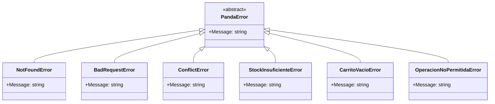
```mermaid
classDiagram
    class PandaError {
        <<abstract>>
        +Message: string
    }
    
    class NotFoundError {
        +Message: string
    }
    
    class BadRequestError {
        +Message: string
    }
    
    class ConflictError {
        +Message: string
    }
    
    class StockInsuficienteError {
        +Message: string
    }
    
    class CarritoVacioError {
        +Message: string
    }
    
    class OperacionNoPermitidaError {
        +Message: string
    }
    
    PandaError <|-- NotFoundError
    PandaError <|-- BadRequestError
    PandaError <|-- ConflictError
    PandaError <|-- StockInsuficienteError
    PandaError <|-- CarritoVacioError
    PandaError <|-- OperacionNoPermitidaError
```

---

## 8. Páginas de la Aplicación

### 8.1 Mapa de Navegación

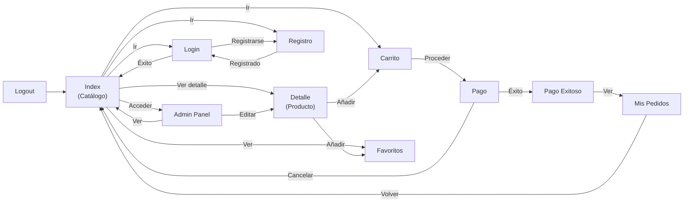
```mermaid
flowchart LR
    Index["Index<br/>(Catálogo)"]
    Detalle["Detalle<br/>(Producto)"]
    Carrito["Carrito"]
    Favoritos["Favoritos"]
    Pago["Pago"]
    PagoOk["Pago Exitoso"]
    Pedidos["Mis Pedidos"]
    Login["Login"]
    Register["Registro"]
    Logout["Logout"]
    Admin["Admin Panel"]

    Index -->|"Ver detalle"| Detalle
    Index -->|"Ir"| Carrito
    Index -->|"Ver"| Favoritos
    Index -->|"Ir"| Login
    Index -->|"Ir"| Register
    Index -->|"Acceder"| Admin
    
    Detalle -->|"Añadir"| Carrito
    Detalle -->|"Añadir"| Favoritos
    
    Carrito -->|"Proceder"| Pago
    Pago -->|"Éxito"| PagoOk
    Pago -->|"Cancelar"| Index
    
    PagoOk -->|"Ver"| Pedidos
    Pedidos -->|"Volver"| Index
    
    Login -->|"Éxito"| Index
    Login -->|"Registrarse"| Register
    
    Register -->|"Registrado"| Login
    
    Logout --> Index
    
    Admin -->|"Ver"| Index
    Admin -->|"Editar"| Detalle
```

### 8.2 Descripción de Páginas

| Página | Ruta | Descripción | Requiere Auth |
|--------|------|-------------|---------------|
| Index | / | Catálogo principal con filtros por categoría | No |
| Detalle | /Detalle/{id} | Información completa de un producto | No |
| Carrito | /Carrito | Carrito de compras | Sí |
| Favoritos | /Favoritos | Lista de productos favoritos | Sí |
| Pago | /Pago | Proceso de checkout con Stripe | Sí |
| PagoExitoso | /PagoExitoso | Confirmación de compra | Sí |
| Pedidos | /Pedidos | Historial de pedidos | Sí |
| Login | /Login | Inicio de sesión | No |
| Register | /Register | Registro de nuevo usuario | No |
| AdminPanel | /AdminPanel | Gestión de productos | Admin |

---

## 9. Componentes Blazor (Tiempo Real)

### 9.1 Componentes Implementados

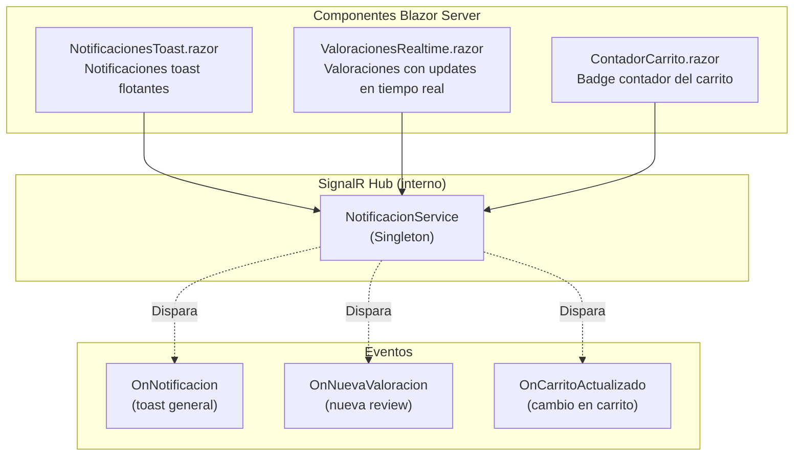
```mermaid
flowchart TB
    subgraph BlazorComponents["Componentes Blazor Server"]
        NT["NotificacionesToast.razor<br/>Notificaciones toast flotantes"]
        VR["ValoracionesRealtime.razor<br/>Valoraciones con updates en tiempo real"]
        CC["ContadorCarrito.razor<br/>Badge contador del carrito"]
    end

    subgraph SignalR["SignalR Hub (interno)"]
        NS["NotificacionService<br/>(Singleton)"]
    end

    subgraph Events["Eventos"]
        E1["OnNotificacion<br/>(toast general)"]
        E2["OnNuevaValoracion<br/>(nueva review)"]
        E3["OnCarritoActualizado<br/>(cambio en carrito)"]
    end

    NT --> NS
    VR --> NS
    CC --> NS
    
    NS -.->|"Dispara"| E1
    NS -.->|"Dispara"| E2
    NS -.->|"Dispara"| E3
```

### 9.2 NotificacionService (Singleton)

```csharp
// Eventos disponibles
public event Action<string, Notificacion>? OnNotificacion;      // Para un usuario
public event Action<string, Notificacion>? OnNotificacion;      // Para todos
public event Action<long>? OnNuevaValoracion;                    // Nueva valoración
public event Action<string, int>? OnCarritoActualizado;          // Carrito actualizado
```

---

## 10. Tecnologías y Dependencias

### 10.1 Stack Tecnológico

| Capa | Tecnología | Versión |
|------|------------|---------|
| **Runtime** | .NET | 10.0 |
| **Frontend** | ASP.NET Core Razor Pages | 10.0 |
| **Componentes** | Blazor Server | 10.0 |
| **CSS Framework** | Tailwind CSS | 3.x |
| **UI Components** | DaisyUI | 4.x |
| **Icons** | Font Awesome | 6.x |
| **Database** | PostgreSQL | - |
| **ORM** | Entity Framework Core | 10.0 |
| **Auth** | ASP.NET Identity | - |
| **API** | REST (ApiController) | - |
| **Real-time** | Blazor SignalR | - |
| **Testing Unit** | xUnit | - |
| **Testing E2E** | Playwright | - |

### 10.2 Paquetes NuGet Principales

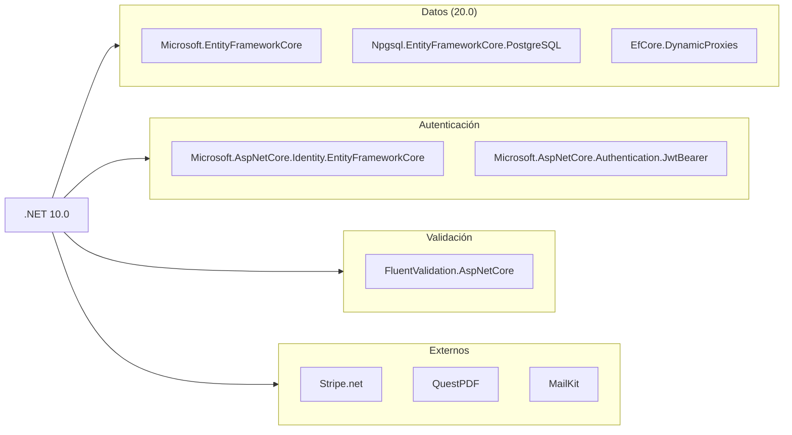
```mermaid
graph LR
    Core[".NET 10.0"]
    
    subgraph Data["Datos (20.0)"]
        EF["Microsoft.EntityFrameworkCore"]
        EFN["Npgsql.EntityFrameworkCore.PostgreSQL"]
        EFProxies["EfCore.DynamicProxies"]
    end
    
    subgraph Auth["Autenticación"]
        Identity["Microsoft.AspNetCore.Identity.EntityFrameworkCore"]
        JWT["Microsoft.AspNetCore.Authentication.JwtBearer"]
    end
    
    subgraph Validation["Validación"]
        Fluent["FluentValidation.AspNetCore"]
    end
    
    subgraph External["Externos"]
        Stripe["Stripe.net"]
        QuestPDF["QuestPDF"]
        MailKit["MailKit"]
    end
    
    Core --> Data
    Core --> Auth
    Core --> Validation
    Core --> External
```

---

## 11. Flujos de Usuario

### 11.1 Flujo de Registro e Inicio de Sesión

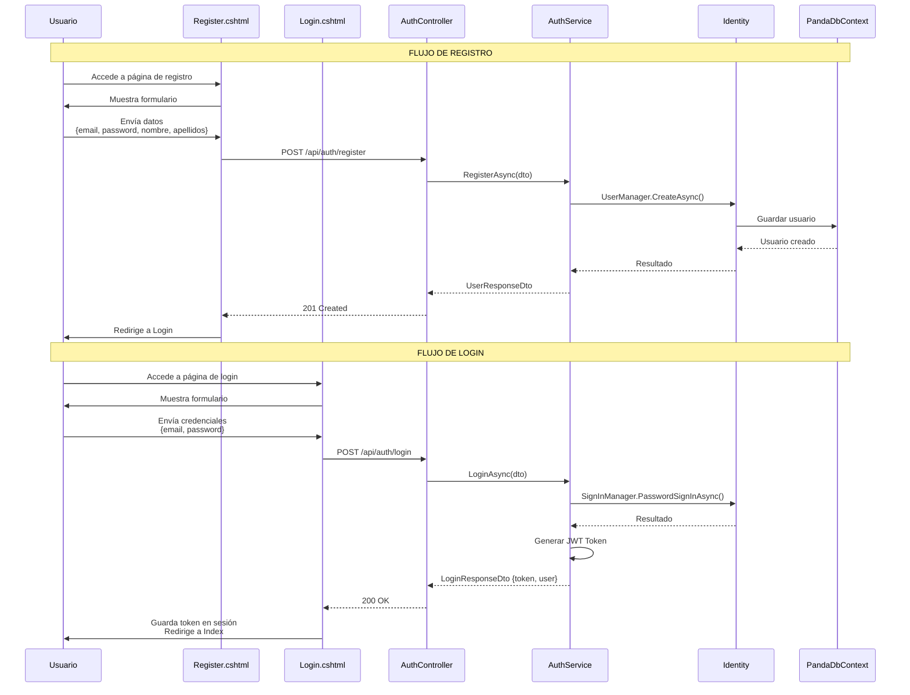
```mermaid
sequenceDiagram
    participant U as Usuario
    participant R as Register.cshtml
    participant L as Login.cshtml
    participant AC as AuthController
    participant AS as AuthService
    participant ID as Identity
    participant DB as PandaDbContext

    Note over U,DB: FLUJO DE REGISTRO
    U->>R: Accede a página de registro
    R->>U: Muestra formulario
    
    U->>R: Envía datos<br/>{email, password, nombre, apellidos}
    R->>AC: POST /api/auth/register
    AC->>AS: RegisterAsync(dto)
    AS->>ID: UserManager.CreateAsync()
    ID->>DB: Guardar usuario
    DB-->>ID: Usuario creado
    ID-->>AS: Resultado
    AS-->>AC: UserResponseDto
    AC-->>R: 201 Created
    R->>U: Redirige a Login

    Note over U,DB: FLUJO DE LOGIN
    U->>L: Accede a página de login
    L->>U: Muestra formulario
    
    U->>L: Envía credenciales<br/>{email, password}
    L->>AC: POST /api/auth/login
    AC->>AS: LoginAsync(dto)
    AS->>ID: SignInManager.PasswordSignInAsync()
    ID-->>AS: Resultado
    AS->>AS: Generar JWT Token
    AS-->>AC: LoginResponseDto {token, user}
    AC-->>L: 200 OK
    L->>U: Guarda token en sesión<br/>Redirige a Index
```

### 11.2 Flujo de Compra Completo

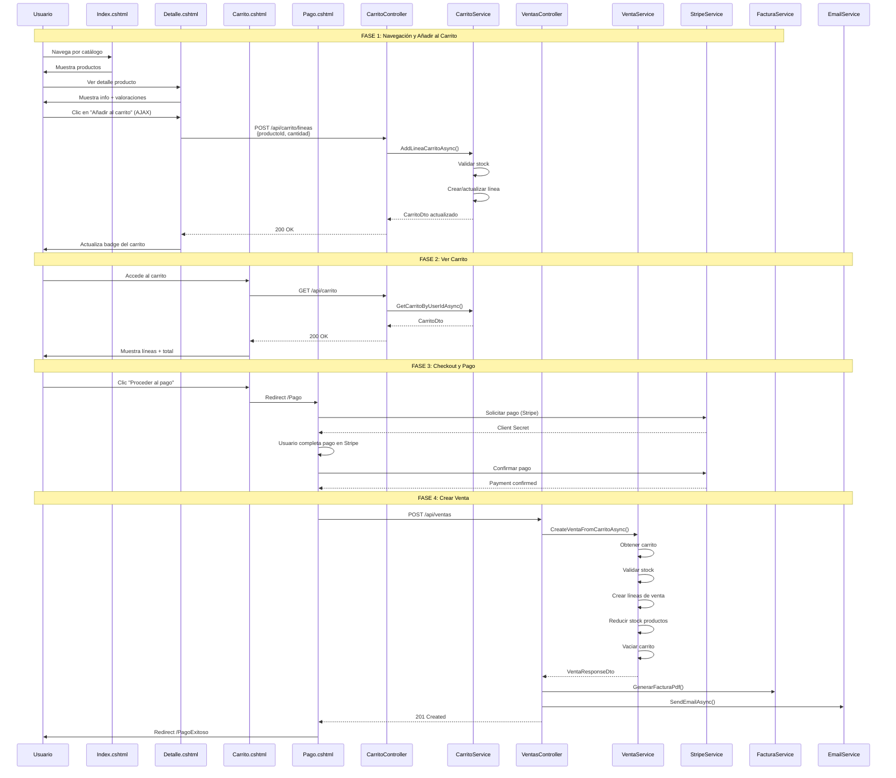
```mermaid
sequenceDiagram
    participant U as Usuario
    participant I as Index.cshtml
    participant D as Detalle.cshtml
    participant C as Carrito.cshtml
    participant P as Pago.cshtml
    participant CC as CarritoController
    participant CS as CarritoService
    participant VC as VentasController
    participant VS as VentaService
    participant SS as StripeService
    participant FS as FacturaService
    participant ES as EmailService

    Note over U,FS: FASE 1: Navegación y Añadir al Carrito
    U->>I: Navega por catálogo
    I->>U: Muestra productos
    
    U->>D: Ver detalle producto
    D->>U: Muestra info + valoraciones
    
    U->>D: Clic en "Añadir al carrito" (AJAX)
    D->>CC: POST /api/carrito/lineas<br/>{productoId, cantidad}
    CC->>CS: AddLineaCarritoAsync()
    CS->>CS: Validar stock
    CS->>CS: Crear/actualizar línea
    CS-->>CC: CarritoDto actualizado
    CC-->>D: 200 OK
    D->>U: Actualiza badge del carrito

    Note over U,ES: FASE 2: Ver Carrito
    U->>C: Accede al carrito
    C->>CC: GET /api/carrito
    CC->>CS: GetCarritoByUserIdAsync()
    CS-->>CC: CarritoDto
    CC-->>C: 200 OK
    C->>U: Muestra líneas + total

    Note over U,ES: FASE 3: Checkout y Pago
    U->>C: Clic "Proceder al pago"
    C->>P: Redirect /Pago
    
    P->>SS: Solicitar pago (Stripe)
    SS-->>P: Client Secret
    
    P->>P: Usuario completa pago en Stripe
    P->>SS: Confirmar pago
    SS-->>P: Payment confirmed

    Note over U,ES: FASE 4: Crear Venta
    P->>VC: POST /api/ventas
    VC->>VS: CreateVentaFromCarritoAsync()
    VS->>VS: Obtener carrito
    VS->>VS: Validar stock
    VS->>VS: Crear líneas de venta
    VS->>VS: Reducir stock productos
    VS->>VS: Vaciar carrito
    VS-->>VC: VentaResponseDto
    VC->>FS: GenerarFacturaPdf()
    VC->>ES: SendEmailAsync()
    VC-->>P: 201 Created
    P->>U: Redirect /PagoExitoso
```

### 11.3 Flujo de Valoraciones

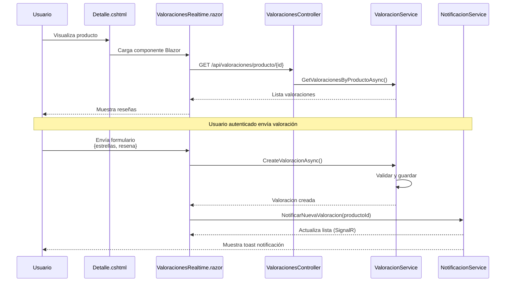
```mermaid
sequenceDiagram
    participant U as Usuario
    participant D as Detalle.cshtml
    participant VR as ValoracionesRealtime.razor
    participant VC as ValoracionesController
    participant VS as ValoracionService
    participant NS as NotificacionService

    U->>D: Visualiza producto
    D->>VR: Carga componente Blazor
    VR->>VC: GET /api/valoraciones/producto/{id}
    VC->>VS: GetValoracionesByProductoAsync()
    VS-->>VR: Lista valoraciones
    VR-->>U: Muestra reseñas

    Note over U,NS: Usuario autenticado envía valoración
    U->>VR: Envía formulario<br/>{estrellas, resena}
    VR->>VS: CreateValoracionAsync()
    VS->>VS: Validar y guardar
    VS-->>VR: Valoracion creada
    VR->>NS: NotificarNuevaValoracion(productoId)
    NS-->>VR: Actualiza lista (SignalR)
    NS-->>U: Muestra toast notificación
```

### 11.4 Flujo de Gestión de Pedidos (Admin)

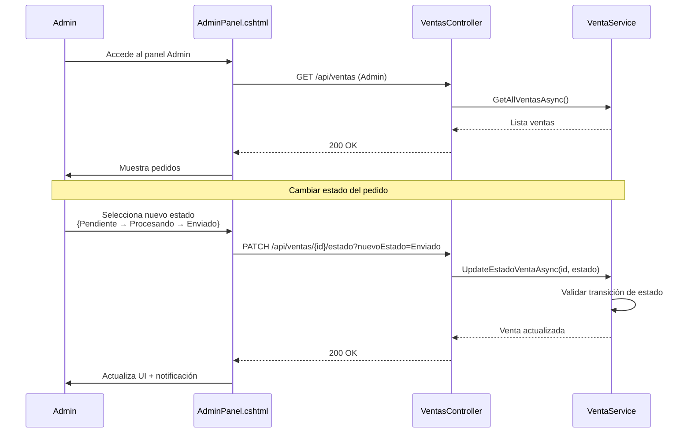
```mermaid
sequenceDiagram
    participant A as Admin
    participant AP as AdminPanel.cshtml
    participant VC as VentasController
    participant VS as VentaService

    A->>AP: Accede al panel Admin
    AP->>VC: GET /api/ventas (Admin)
    VC->>VS: GetAllVentasAsync()
    VS-->>VC: Lista ventas
    VC-->>AP: 200 OK
    AP->>A: Muestra pedidos

    Note over A,VS: Cambiar estado del pedido
    A->>AP: Selecciona nuevo estado<br/>{Pendiente → Procesando → Enviado}
    AP->>VC: PATCH /api/ventas/{id}/estado?nuevoEstado=Enviado
    VC->>VS: UpdateEstadoVentaAsync(id, estado)
    VS->>VS: Validar transición de estado
    VS-->>VC: Venta actualizada
    VC-->>AP: 200 OK
    AP->>A: Actualiza UI + notificación
```

### 11.5 Flujo de Confirmación de Entrega (Usuario)

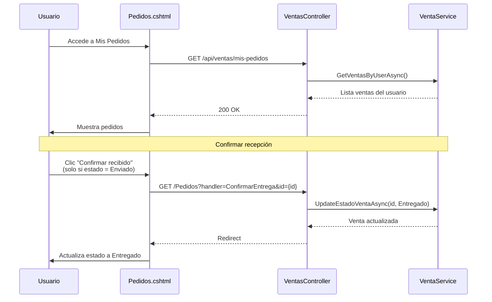
```mermaid
sequenceDiagram
    participant U as Usuario
    participant P as Pedidos.cshtml
    participant VC as VentasController
    participant VS as VentaService

    U->>P: Accede a Mis Pedidos
    P->>VC: GET /api/ventas/mis-pedidos
    VC->>VS: GetVentasByUserAsync()
    VS-->>VC: Lista ventas del usuario
    VC-->>P: 200 OK
    P->>U: Muestra pedidos

    Note over U,VS: Confirmar recepción
    U->>P: Clic "Confirmar recibido"<br/>(solo si estado = Enviado)
    P->>VC: GET /Pedidos?handler=ConfirmarEntrega&id={id}
    VC->>VS: UpdateEstadoVentaAsync(id, Entregado)
    VS-->>VC: Venta actualizada
    VC-->>P: Redirect
    P->>U: Actualiza estado a Entregado
```

### 11.2 Flujo de Valoración

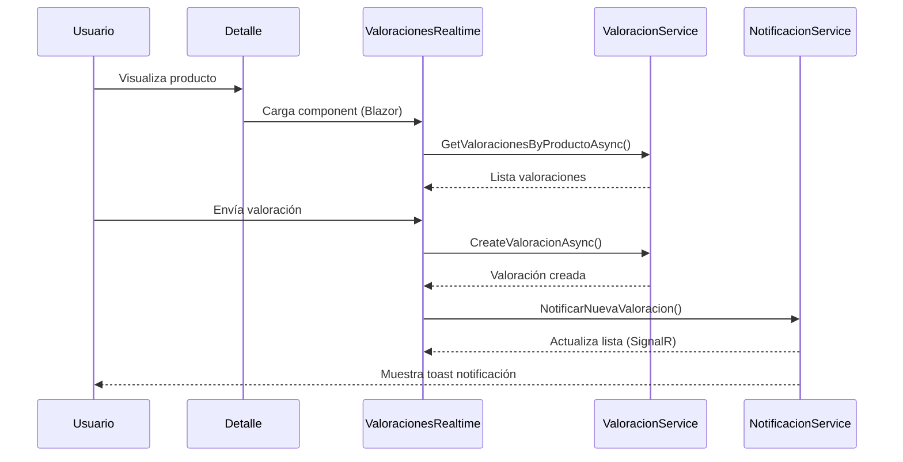
```mermaid
sequenceDiagram
    participant U as Usuario
    participant D as Detalle
    participant VR as ValoracionesRealtime
    participant VS as ValoracionService
    participant NS as NotificacionService

    U->>D: Visualiza producto
    D->>VR: Carga component (Blazor)
    VR->>VS: GetValoracionesByProductoAsync()
    VS-->>VR: Lista valoraciones
    
    U->>VR: Envía valoración
    VR->>VS: CreateValoracionAsync()
    VS-->>VR: Valoración creada
    
    VR->>NS: NotificarNuevaValoracion()
    NS-->>VR: Actualiza lista (SignalR)
    NS-->>U: Muestra toast notificación
```

---

## 12. Presupuesto del Proyecto

### 12.1 Estimación de Horas por Fase

| Fase | Descripción | Horas | Coste (3 devs) |
|------|-------------|-------|----------------|
| **Fase 1: Setup** | Configuración solución, proyectos, NuGet, Docker | 24h | 1.800€ |
| **Fase 2: Modelos y DTOs** | Entidades EF Core, DTOs, Mapeadores | 40h | 3.000€ |
| **Fase 3: Repositorios** | CRUD con EF Core, queries personalizadas | 56h | 4.200€ |
| **Fase 4: Servicios** | Lógica de negocio, validaciones, errores | 72h | 5.400€ |
| **Fase 5: API REST** | Controladores, documentación Swagger | 32h | 2.400€ |
| **Fase 6: Frontend Pages** | Razor Pages principales (10 páginas) | 80h | 6.000€ |
| **Fase 7: Componentes Blazor** | Notificaciones, valoraciones real-time | 40h | 3.000€ |
| **Fase 8: UI/UX** | Tailwind, DaisyUI, animaciones, responsive | 56h | 4.200€ |
| **Fase 9: Integraciones** | Stripe, QuestPDF, MailKit | 24h | 1.800€ |
| **Fase 10: Testing** | Unit tests (xUnit), E2E (Playwright) | 48h | 3.600€ |
| **Fase 11: Documentación** | README, comentarios XML, this doc | 24h | 1.800€ |
| **Fase 12: Ajustes y Tests** | Bug fixes, optimizaciones, refinamiento | 64h | 4.800€ |
| | **TOTAL** | **560h** | **42.000€** |

### 12.2 Costes Adicionales (Año 1)

| Concepto | Coste Estimado |
|----------|----------------|
| Dominio (pandadaw.com) | 12€/año |
| Hosting (Railway/Render - PostgreSQL) | 25€/mes × 12 = 300€/año |
| Hosting (Railway/Render - Web App) | 0-15€/mes × 12 = 0-180€/año |
| SSL (Let's Encrypt) | Gratis |
| **Total Infra Year 1** | **312-492€** |

### 12.3 Resumen Budget

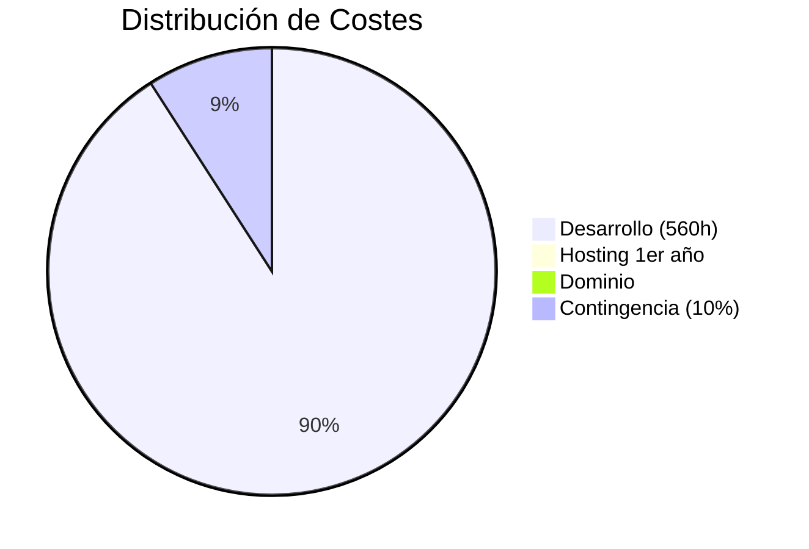
```mermaid
pie title Distribución de Costes
    "Desarrollo (560h)" : 42
    "Hosting 1er año" : 0.4
    "Dominio" : 0.012
    "Contingencia (10%)" : 4.2
```

| Concepto | Importe |
|----------|---------|
| **Desarrollo (560h × 25€ × 3 devs)** | 42.000€ |
| **Infraestructura Year 1** | ~400€ |
| **Dominio** | 12€ |
| **Contingencia (10%)** | 4.200€ |
| **TOTAL PROYECTO** | **~46.612€** |

### 12.4 Distribución por Desarrollador

| Métrica | Valor |
|---------|-------|
| Horas totales | 560h |
| Horas por desarrollador | ~187h |
| Coste por desarrollador | 14.000€ |

---

## 13. Mejores Prácticas Implementadas

### 13.1 Patrones de Diseño

- ✅ **Repository Pattern**: Abstracción del acceso a datos
- ✅ **Service Layer**: Lógica de negocio encapsulada
- ✅ **DTOs**: Transferencia de datos controlada
- ✅ **Dependency Injection**: Inyección de dependencias nativa
- ✅ **Singleton Pattern**: NotificacionService
- ✅ **Result Pattern**: CSharpFunctionalExtensions para manejo de errores

### 13.2 Seguridad

- ✅ **ASP.NET Identity**: Autenticación robusta
- ✅ **Password Hashing**: BCrypt con Identity
- ✅ **Role-based Authorization**: Admin vs Usuario
- ✅ **Input Validation**: FluentValidation
- ✅ **SQL Injection Protection**: Entity Framework parametrizado
- ✅ **AntiForgery Tokens**: Protección CSRF

### 13.3 Calidad de Código

- ✅ **XML Documentation**: Todos los métodos documentados
- ✅ **InheritDoc**: Interfaces implementadas coninheritdoc
- ✅ **Code Analysis**: nullable reference types
- ✅ **Async/Await**: Operaciones asíncronas

---

## 14. Glosario

| Término | Definición |
|---------|------------|
| **DTO** | Data Transfer Object - Objeto para transferir datos entre capas |
| **Repository** | Patrón para abstraer el acceso a datos |
| **Service** | Clase que encapsula lógica de negocio |
| **Blazor** | Framework .NET para crear interfaces web interactivas |
| **Razor Pages** | Modelo de desarrollo web basado en páginas MVC |
| **SignalR** | Biblioteca para comunicación en tiempo real |
| **Identity** | Sistema de autenticación y autorización de ASP.NET |
| **FluentValidation** | Biblioteca para validaciones fluent |
| **Soft Delete** | Eliminación lógica (IsDeleted = true) |
| **Data Seeder** | Datos iniciales cargados al crear la BD |

---

## 15. Anexos

### A. Comandos Útiles

```bash
# Restaurar paquetes
dotnet restore

# Compilar proyecto
dotnet build

# Ejecutar tests unitarios
dotnet test

# Ejecutar aplicación
dotnet run --project PandaDawRazor

# Añadir migración EF Core
dotnet ef migrations add InitialCreate --project PandaBack

# Actualizar base de datos
dotnet ef database update

# Ejecutar tests E2E
dotnet test PandaDaw-Playwright
```

### B. Variables de Entorno (.env)

```env
# Database
DB_CONNECTION_STRING=Host=localhost;Database=pandadaw;Username=postgres;Password=your_password

# JWT
JWT_SECRET=your-super-secret-key-min-32-chars
JWT_EXPIRY_HOURS=24

# Stripe
Stripe__PublishableKey=pk_test_...
Stripe__SecretKey=sk_test_...

# Email (SMTP)
SMTP_HOST=smtp.gmail.com
SMTP_PORT=587
SMTP_USER=your@email.com
SMTP_PASSWORD=your_password
```

### C. Estructura de la Solución

```
PandaDaw/
├── PandaDaw.sln
├── PandaBack/
│   ├── PandaBack.csproj
│   └── [carpetas del proyecto]
├── PandaDawRazor/
│   ├── PandaDawRazor.csproj
│   └── [carpetas del proyecto]
├── Tests/
│   ├── Tests.csproj
│   └── Services/
└── PandaDaw-Playwright/
    ├── PandaDaw-Playwright.csproj
    └── Tests/
```

---

## 16. Próximos Pasos (Mejoras Futuras)

- [ ] Implementar búsqueda avanzada de productos
- [ ] Sistema de cupones de descuento
- [ ] Chat de soporte en tiempo real
- [ ] Panel de analytics para Admin
- [ ] App móvil (MAUI/Blazor Hybrid)
- [ ] Sistema de notificaciones push
- [ ] Multiidioma (i18n)
- [ ] Caché con Redis
- [ ] CI/CD con GitHub Actions
- [ ] Docker compose para desarrollo

---

**Documento generado automáticamente para PandaDaw**  
*Febrero 2026*  
*Equipo de Desarrollo: 3 desarrolladores*
